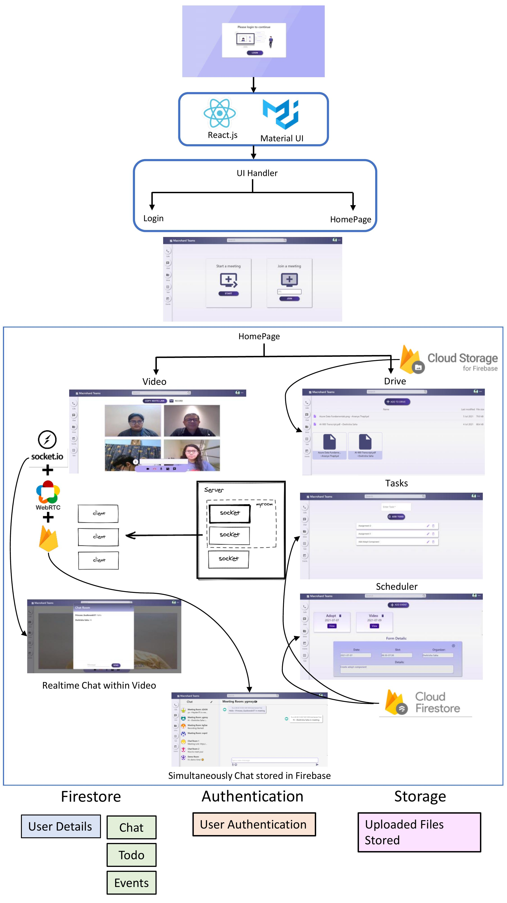

## MACROHARD TEAMS: A MICROSOFT TEAMS CLONE 
#### :link: [https://macrohard-teams.web.app/](https://macrohard-teams.web.app/) - (Built for [Microsoft Engage 2021 Challenge](https://microsoft.acehacker.com/engage2021/?mc_cid=a82d11f2ad&mc_eid=89874c26af) )

 ###  :star: Adopt Feature Implemented :heavy_check_mark:

### :key:Login Instructions:
Please use a Gmail account for Google authentication. Any Gmail account can be used to login. Incase you do not wish to use you personal account, the following Gmail accounts can be used for Google authentication:\
#### - Email: demoengage1@gmail.com, demoengage2@gmail.com, demoengage2@gmail.com
#### - Password for all accounts: engage2021$

 ## :rocket:<ins>*Solution Functionalities</ins> :~*
 
 ### :large_blue_diamond: <ins>Multi-user Video Calling + Realtime Chat</ins> 
  The Video Chat includes following functionalities:

  1. Multiple participants can join
  2. Live Video Transcription using **Speech-to-Text Recognition (Natural Language Processing)** 
  3. Email participants using [EmailJS](https://www.emailjs.com/)
  4. Screen Sharing
  5. Realtime Chat              
  6. Audio mute/unmute
  7. Video on/off
  8. Record screen
  9. Start a meeting or Join with URL

---
 ### :video_camera: Adopt Feature:
:boom: Users have the option to create a room to start a conversation whenever they want.\
:boom: Start a video call feature is available both within the chat room itself and under the Call tab.\
:boom: It is not compulsory to create a chat room from prior, a new chat room is created as soon as a meeting is started under the Call tab and if no chat room is pre-existing for it.\
:boom: Conversations are recorded in the database before the meeting, during the meeting and after the meeting without any interruption and the realtime chat within meeting is stored in the database and available in the room even after meeting is ended.

---

 ### :large_blue_diamond: <ins>Chatting</ins> 
  1. Group Chat Rooms to allow multiple participants to chat
  2. Create new rooms real-time
  3. Start video meeting from within chat with multiple participants
  4. Uploading and sending files as link easily with a click
  5. Emoji Picker to use during chatting
  
### :large_blue_diamond: <ins>Drive for Files</ins> 
  1. Easily upload files of any format to the drive with just 2-3 clicks
  2. All the files uploaded and shown in order of time uploaded with file name, user name, size of file and date of last modification
  3. The files are presented in both grid (card) and list form

### :large_blue_diamond: <ins>Tasks</ins> 
:heavy_check_mark: Full CRUD Functionality(Create, Read, Update & Delete)
1. Add new tasks to database
2. Edit/Update the tasks in database
3. Delete tasks from database

### :large_blue_diamond: <ins>Events</ins> 
1. Add Events using Datepicker, then events are arranged in order of descendance.
2. Delete the events as required.
3. Events are shown in card form in grid view. We can view full details on clicking view.
4. Organizer name added automatically.
 
  ## :rocket:<ins>*Application Architecture</ins>:*~
 
 
 ## :rocket:<ins>*Tech Stack Used</ins> :*~
- React.js
- Node.js
- JavaScript
- WebRTC
- Socket.io
- HTML
- CSS
- Firebase

 ## :rocket:<ins>*Details</ins>:*~
Your solution should be a fully functional prototype with at least one mandatory functionality - a minimum of two participants should be able connect with each other using your product to have a video conversation.

 ## :rocket:<ins>*Credits</ins> :*~
Video Meeting component was open-sourced and re-purposed from [Video Meeting](https://github.com/0x5eba/Video-Meeting). Additional features such as inviting participants via email etc. were added externally.

Video chat functionalities were implemented using [WebRTC API](https://webrtc.org/) and [Socket.IO](https://socket.io/)

Todo App reference: [react-firebase-materialui-todo-app](https://github.com/ipsjolly/react-firebase-materialui-todo-app)

Discussed project ideation with [Ananya Thapliyal](https://github.com/AnanyaThapliyal2303)

This project was bootstrapped with [Create React App](https://github.com/facebook/create-react-app).

## Available Scripts

In the project directory, you can run:

### `npm start`

Runs the app in the development mode.\
Open [https://macrohard-teams.web.app/](https://macrohard-teams.web.app/) to view it in the browser.

The page will reload if you make edits.\
You will also see any lint errors in the console.

### `npm test`

Launches the test runner in the interactive watch mode.\
See the section about [running tests](https://facebook.github.io/create-react-app/docs/running-tests) for more information.

### `npm run build`

Builds the app for production to the `build` folder.\
It correctly bundles React in production mode and optimizes the build for the best performance.

The build is minified and the filenames include the hashes.\
Your app is ready to be deployed!

See the section about [deployment](https://facebook.github.io/create-react-app/docs/deployment) for more information.

### `npm run eject`

**Note: this is a one-way operation. Once you `eject`, you can’t go back!**

If you aren’t satisfied with the build tool and configuration choices, you can `eject` at any time. This command will remove the single build dependency from your project.

Instead, it will copy all the configuration files and the transitive dependencies (webpack, Babel, ESLint, etc) right into your project so you have full control over them. All of the commands except `eject` will still work, but they will point to the copied scripts so you can tweak them. At this point you’re on your own.

You don’t have to ever use `eject`. The curated feature set is suitable for small and middle deployments, and you shouldn’t feel obligated to use this feature. However we understand that this tool wouldn’t be useful if you couldn’t customize it when you are ready for it.

## Learn More

You can learn more in the [Create React App documentation](https://facebook.github.io/create-react-app/docs/getting-started).

To learn React, check out the [React documentation](https://reactjs.org/).

### Code Splitting

This section has moved here: [https://facebook.github.io/create-react-app/docs/code-splitting](https://facebook.github.io/create-react-app/docs/code-splitting)

### Analyzing the Bundle Size

This section has moved here: [https://facebook.github.io/create-react-app/docs/analyzing-the-bundle-size](https://facebook.github.io/create-react-app/docs/analyzing-the-bundle-size)

### Making a Progressive Web App

This section has moved here: [https://facebook.github.io/create-react-app/docs/making-a-progressive-web-app](https://facebook.github.io/create-react-app/docs/making-a-progressive-web-app)

### Advanced Configuration

This section has moved here: [https://facebook.github.io/create-react-app/docs/advanced-configuration](https://facebook.github.io/create-react-app/docs/advanced-configuration)

### Deployment

This section has moved here: [https://facebook.github.io/create-react-app/docs/deployment](https://facebook.github.io/create-react-app/docs/deployment)

### `npm run build` fails to minify

This section has moved here: [https://facebook.github.io/create-react-app/docs/troubleshooting#npm-run-build-fails-to-minify](https://facebook.github.io/create-react-app/docs/troubleshooting#npm-run-build-fails-to-minify)

